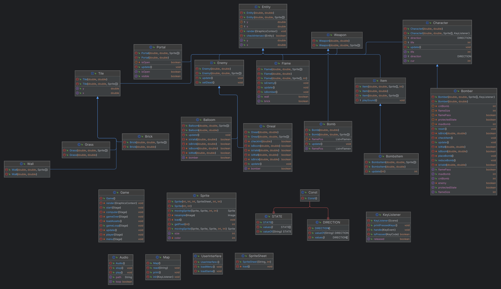

<h1 align="center">Bomberman</h1>

This is my game project for Orientation Programming at University of Engineering and Technology, Vietnam National University.

# Table of contents

- [Information](#information)
- [Inheritance tree](#inheritance-tree)
- [Checklist](#checklist)

## Information

**Name:**  Đặng Tiến Dũng  
**Student ID:** 22026523  
**Class:** K67J  
**Email:** dangtiendung1201@gmail.com  
**Facebook:** fb.com/dangtiendung1201  

## Inheritance tree

## Checklist

- Gói bắt buộc (+8đ)
- [x] Thiết kế cây thừa kế cho các đối tượng game +2đ
- [x] Xây dựng bản đồ màn chơi từ tệp cấu hình (có mẫu tệp cấu hình, xem [tại đây](https://raw.githubusercontent.com/bqcuong/bomberman-starter/starter-2/res/levels/Level1.txt)) +1đ
- [x] Di chuyển Bomber theo sự điều khiển từ người chơi +1đ
- [x] Tự động di chuyển các Enemy +1đ
- [x] Xử lý va chạm cho các đối tượng Bomber, Enemy, Wall, Brick, Bomb +1đ
- [x] Xử lý bom nổ +1đ
- [x] Xử lý khi Bomber sử dụng các Item và khi đi vào vị trí Portal +1đ

- Gói tùy chọn (tối đa +2đ)
- [ ] Nâng cấp thuật toán tìm đường cho Enemy +0.5đ
   Cài đặt thêm các loại Enemy khác: +0.25đ cho mỗi loại enemy
- [ ] Cài đặt thuật toán AI cho Bomber (tự chơi) +1đ
- [x] Xử lý hiệu ứng âm thanh (thêm music & sound effects) +1đ
- [ ] Phát triển hệ thống server-client để nhiều người có thể cùng chơi qua mạng LAN hoặc Internet +1đ
- [ ] Những ý tưởng khác sẽ được đánh giá và cộng điểm theo mức tương ứng